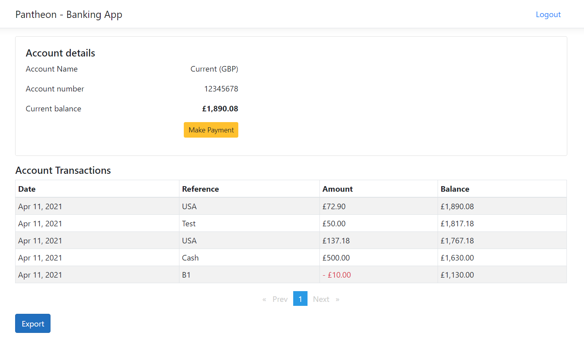

# Simple Banking application

A sample application to know the account details (balance) and transactions.
Users can able to deposit & withdraw money from their account. Transactions can be
exportable to CSV format. Users can be able to use USD currency for transactions without any charges.

Applciation coded as clean architecture with repository patteten and CQRS. Applciation separated 
entities, persistence, external services into layers to have a flexibility write test cases. 
Entity framework code first used for database designs & queries. Asp.Net core Identity used for user authentication.

MSSQLLocalDB local databases used for both Identity and main application. A sample user & bank 
account created on start of the application.

**Test User account:**

*user@test.com*  
*Plural&01?*

Login details are auto populated in the component for quick login. Please note that this 
approach is only used for speeding application test.

All database connections & third party API details are in stored appsetings.json. 

https://localhost:44327/swagger/index.html port may different for your environment. 

**Sample screenshot**

##### Below Technologies used for this application.
1. .NET Core 3.1 Web API
2. Entity Framework
3. Angular 8
4. SQL
4. Nunit & Moq
5. AutoMapper
6. Clean architecture
7. Repositoy pattern & CQRS
8. Serilog for file system logging
9. Swagger